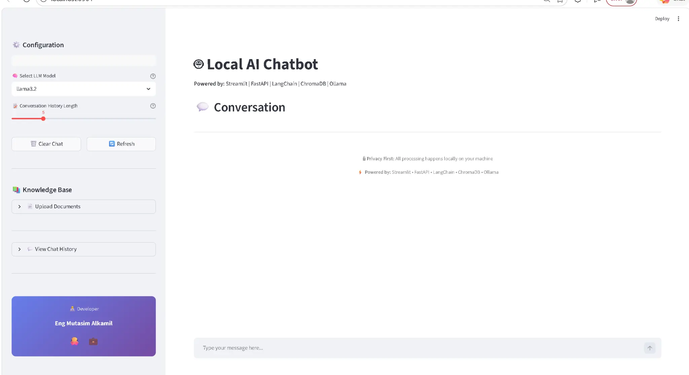

# 🤖 Local AI Chatbot with Dynamic RAG

A professional, local-first AI chatbot implementation featuring **Retrieval-Augmented Generation (RAG)**. This project allows you to chat with various local LLMs and interact with your own documents (PDF/TXT) with full privacy, as all processing happens locally on your machine.

---

## 📸 User Interface

<div align="center">

<p><i>The clean and intuitive Streamlit-based interface for local AI interaction.</i></p>
</div>

---

## 🚀 Key Features

*   **Local-First Architecture**: Powered by **Ollama**, ensuring your data never leaves your machine.
*   **Dynamic RAG**: Upload PDF or TXT files on-the-fly to expand the chatbot's knowledge base.
*   **Persistent Knowledge Base**: Uses **ChromaDB** for efficient vector storage and retrieval.
*   **Streaming Responses**: Real-time message streaming for a smooth user experience.
*   **Multi-Model Support**: Easily switch between models like `Llama 3.2`, `DeepSeek-R1`, and more.
*   **Professional UI**: A clean, responsive interface built with **Streamlit**.
*   **FastAPI Backend**: Robust and scalable API handling the RAG logic and streaming.
*   **Docker Ready**: Fully containerized for easy deployment and environment consistency.

---

## 🛠 Technology Stack

| Component | Technology |
| :--- | :--- |
| **Frontend** | [Streamlit](https://streamlit.io/) |
| **Backend API** | [FastAPI](https://fastapi.tiangolo.com/) |
| **LLM Orchestration** | [LangChain](https://www.langchain.com/) |
| **Vector Database** | [ChromaDB](https://www.trychroma.com/) |
| **Local LLM Engine** | [Ollama](https://ollama.com/) |
| **Embeddings** | `nomic-embed-text` (via Ollama) |

---

## 🧠 Supported Local Models

This chatbot is designed to work seamlessly with any model supported by **Ollama**. By default, it is configured for:
*   **Llama 3.2**: Meta's latest efficient model.
*   **DeepSeek-R1**: High-performance reasoning model (1.5b, 7b, etc.).
*   **Mistral / Gemma**: Easily add these to `config.py`.

> **Note**: Ensure you have pulled the models locally using `ollama pull <model_name>`.

---

## 🐳 Docker Setup (Recommended)

The easiest way to run the chatbot is using Docker Compose.

### 1. Prerequisites
*   [Docker](https://www.docker.com/) and [Docker Compose](https://docs.docker.com/compose/) installed.
*   [Ollama](https://ollama.com/) running on your host machine.

### 2. Run with Docker Compose
```bash
docker-compose up --build
```
*   **Frontend**: [http://localhost:8501](http://localhost:8501)
*   **Backend API**: [http://localhost:8000](http://localhost:8000)

---

## 💻 Manual Installation

### 1. Clone the Repository
```bash
git clone https://github.com/Asoomkamel/local-ai-chatbot.git
cd local-ai-chatbot
```

### 2. Install Dependencies
```bash
pip install -r requirements.txt
```

### 3. Setup Ollama
Ensure Ollama is running and pull the required models:
```bash
ollama pull llama3.2
ollama pull deepseek-r1:1.5b
ollama pull nomic-embed-text
```

### 4. Run the Application
Start the Backend:
```bash
python api.py
```
Start the Frontend (in a new terminal):
```bash
streamlit run app.py
```

---

## 📂 Project Structure
```text
.
├── app.py              # Streamlit Frontend
├── api.py              # FastAPI Backend
├── llm.py              # LangChain & LLM Logic
├── rag.py              # RAG & Vector DB Management
├── config.py           # Model & App Configuration
├── memory.py           # Chat History Management
├── chroma_db/          # Persistent Vector Store (Generated)
├── uploaded_docs/      # Uploaded Documents (Generated)
├── Dockerfile          # Docker Configuration
└── docker-compose.yml  # Docker Compose Configuration
```

---

## 👨‍💻 Developer
**Eng Mutasim Alkamil**
*   [GitHub](https://github.com/Asoomkamel)
*   [LinkedIn](https://www.linkedin.com/in/mutasim-al-kamil-40a299318)

---

## 📄 License
This project is open-source and available under the MIT License.
